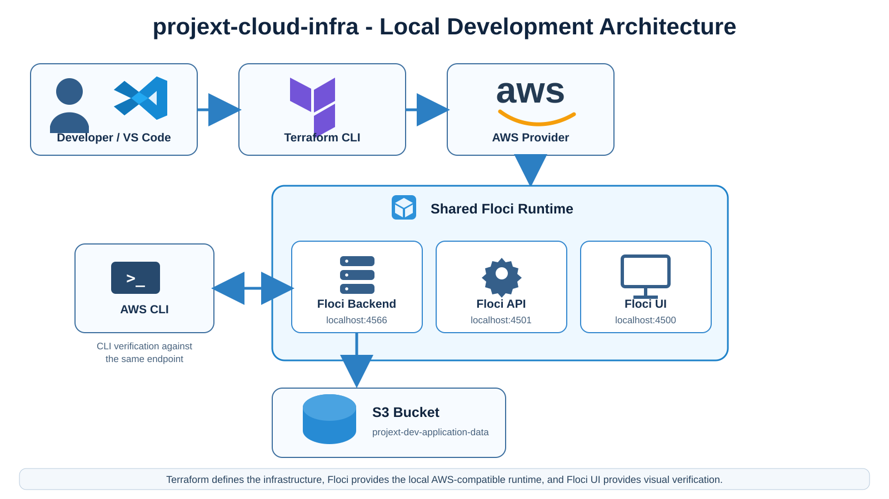

# projext-cloud-infra

Terraform-based infrastructure project for the fictional `projext` environment.

The current setup uses the AWS provider with a local Floci runtime so infrastructure can be developed and tested without creating real AWS resources. The Terraform code is intentionally written to stay close to what would be used in an actual AWS environment.

## Current Architecture



The Floci runtime is started separately from this repository. This repository does not start or own the Floci Docker stack.

For local development:

- Floci UI: `http://localhost:4500`
- Floci API: `http://localhost:4501`
- Floci AWS-compatible backend: `http://localhost:4566`

## What Has Been Built So Far

The project currently manages one S3 bucket:

```text
projext-dev-application-data
```

Terraform local resource address:

```text
aws_s3_bucket.application_data
```

The bucket currently includes these tags:

```text
Project     = projext
Environment = dev
ManagedBy   = terraform
```

The `Project` and `Environment` values are supplied through Terraform variables.

## Repository Structure

```text
projext-cloud-infra/
├── .gitignore
├── .terraform.lock.hcl
├── docs/
│   └── images/
│       └── local-development-architecture.svg
├── main.tf
├── provider.tf
├── variables.tf
└── versions.tf
```

### `versions.tf`

Defines the Terraform and provider requirements for the project.

Current requirements:

- Terraform `>= 1.16.0`
- HashiCorp AWS provider `~> 6.0`

### `provider.tf`

Configures the AWS provider for local development.

For the current Floci environment it:

- uses region `us-east-1`
- uses local test credentials
- skips AWS-specific validation calls that are not required by the emulator
- redirects S3 requests to `http://localhost:4566`

In a real AWS environment, the Floci endpoint override and emulator-specific skip settings would normally be removed. Authentication would instead come from a supported AWS mechanism such as AWS CLI credentials, AWS SSO, environment variables, IAM roles, or CI/CD identity.

### `main.tf`

Defines the infrastructure managed by Terraform.

The current resource is an S3 bucket named:

```text
projext-dev-application-data
```

The Terraform resource type is `aws_s3_bucket`, while `application_data` is the local Terraform name used to reference the resource within the configuration.

### `variables.tf`

Defines reusable input values for the Terraform configuration.

Current variables:

- `project` with default value `projext`
- `environment` with default value `dev`

These values are currently used for resource tagging.

### `.terraform.lock.hcl`

Tracks the exact provider dependency selections made by Terraform during initialization.

This file is committed so developers and CI/CD environments can use consistent provider versions.

### `.gitignore`

Keeps local Terraform-generated files and state out of Git, including:

- `.terraform/`
- `*.tfstate`
- `*.tfstate.*`
- local variable files
- Terraform crash logs

Terraform state is intentionally not stored in Git.

## Terraform Workflow Used So Far

```text
terraform init
    -> initialize the working directory and install providers

terraform fmt
    -> format Terraform configuration files

terraform validate
    -> check configuration syntax and structure

terraform plan
    -> preview infrastructure changes

terraform apply
    -> create or update infrastructure
```

The project has already demonstrated both:

- creating a new resource
- modifying an existing resource in place by adding tags

## Terraform State

Terraform maintains a local `terraform.tfstate` file that records the infrastructure it currently manages.

Useful commands used in this project:

```bash
terraform state list
terraform state show aws_s3_bucket.application_data
```

The state file is local and ignored by Git.

## Local Verification with AWS CLI

The AWS CLI can be pointed directly at the Floci backend.

For a local shell session:

```bash
export AWS_ACCESS_KEY_ID=test
export AWS_SECRET_ACCESS_KEY=test
export AWS_DEFAULT_REGION=us-east-1
```

Then verify local S3 resources with:

```bash
aws s3 ls --endpoint-url http://localhost:4566
```

The Terraform-managed bucket should appear in the results.

## Floci UI

The Floci UI stack runs separately from this repository and provides a visual view of locally emulated AWS resources.

The active local stack contains:

```text
Floci UI      -> localhost:4500
Floci API     -> localhost:4501
Floci backend -> localhost:4566
```

Terraform and the AWS CLI running on the Mac connect to:

```text
http://localhost:4566
```

Containers inside the Floci Docker network can reach the same backend using:

```text
http://floci:4566
```

The distinction is important: `localhost:4566` is the host-facing endpoint, while `floci:4566` is the Docker-internal service address.

## Local Runtime and Persistence

The original standalone Floci Compose configuration was removed from this repository. The shared Floci UI stack is now the local AWS-compatible runtime used by this project.

The current Floci UI stack uses persistent storage, so its resource data can survive normal container recreation when its mounted data directory is retained.

## Floci vs Real AWS

The goal is to keep the infrastructure definitions close to real AWS Terraform.

For example, the S3 resource in `main.tf` can remain essentially the same in both environments.

The main difference is the provider layer:

```text
Local development
Terraform -> AWS provider -> localhost:4566 -> Floci

Real AWS
Terraform -> AWS provider -> AWS APIs
```

This separation allows the project to move toward a real AWS account later without redesigning the resource model from scratch.

## Current Learning Milestones

So far this project has covered:

- Terraform CLI installation and verification
- Terraform project initialization
- provider version management
- Terraform dependency locking
- AWS provider configuration
- local AWS emulation with Floci
- Docker-based Floci runtime
- S3 resource creation
- Terraform planning and apply workflow
- Terraform state inspection
- drift detection after changing the local Floci runtime
- AWS CLI verification against a local endpoint
- Floci UI verification
- Terraform resource tagging
- Terraform input variables
- Git and GitHub workflow for Terraform changes

## Next Steps

The next Terraform topic will continue building on the current configuration while keeping the local Floci environment separate from this repository.
